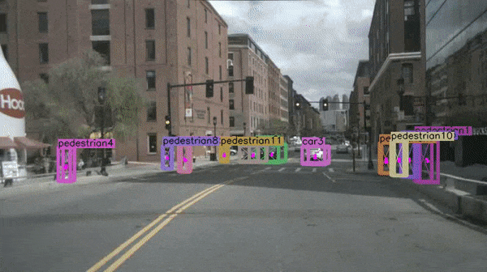

# PFTrack
#Visible-Thermal Multiple Object Tracking: Large-scale Video Dataset and Progressive Fusion Approach
Simultaneous object detection and tracking using center points:

> [**Visible-Thermal Multiple Object Tracking: Large-scale Video Dataset and Progressive Fusion Approach**](http://arxiv.org/abs/2004.01177),            
> Yabin Zhu, Qianwu Wang, Chenglong Li, Jin Tang, Zhixiang Huang  
*************************************************
> *arXiv technical report ([arXiv 2004.01177](http://arxiv.org/abs/2004.01177))*  
*************************************************

    @article{zhou2020tracking,
      title={Visible-Thermal Multiple Object Tracking: Large-scale Video Dataset and Progressive Fusion Approach},
      author={Yabin Zhu, Qianwu Wang, Chenglong Li, Jin Tang, Zhixiang Huang},
      year={2024}
    }
Contact: [1597474391@qq.com](mailto:1597474391@qq.com). Any questions or discussion are welcome! 

## Abstract
The complementary benefits from visible and thermal infrared data are widely utilized in various computer vision task, such as visual tracking, semantic segmentation and object detection, but rarely explored in Multiple Object Tracking (MOT). In this work, we contribute a large-scale Visible-Thermal video benchmark for MOT, called VT-MOT. VT-MOT has the following main advantages. 1) The data is large scale and high diversity. VT-MOT includes 582 video sequence pairs, 401k frame pairs from surveillance, drone, and handheld platforms. 2) The cross-modal alignment is highly accurate. We invite several professionals to perform both spatial and temporal alignment frame by frame. 3) The annotation is dense and high-quality. VT-MOT has 3.99 million annotation boxes annotated and double-checked by professionals, including heavy occlusion and object re-acquisition (object disappear and reappear) challenges.
To provide a strong baseline, we design a simple yet effective tracking framework, which effectively fuses temporal information and complementary information of two modalities in a progressive manner, for robust visible-thermal MOT. 
A comprehensive experiment are conducted on VT-MOT and the results prove the superiority and effectiveness of the proposed method compared with state-of-the-art methods. 

## contribution

- We build a large-scale visible-thermal MOT dataset VT-MOT, which can promote the research and development of MOT in all weather and all day. The dataset includes 582 video sequence pairs with 401k frame pairs captured in surveillance, drone and handheld platforms. 
- We perform manual spatio-temporal alignment of all video sequences of both modalities in a frame by frame manner to ensure high-quality alignment of the two modalities. Moreover, dense and high-quality annotation is provided for comprehensive evaluation of different MOT algorithms. These annotation contain 3.99 million bounding boxes and heavy occlusion and object re-acquisition  challenge labels.
- We also propose a simple yet effective progressive fusion tracking framework, which effectively fuses temporal and complementary information of two modalities in a progressive manner, for robust visible-thermal MOT.
- We perform numerous experiments on VT-MOT dataset, and the results prove the superiority and effectiveness of the
proposed method compared with state-of-the-art methods.
## Main results

### Tracking performance comparison of several evaluated trackers on VT-MOT testing set.

| Method       | Publication | Modality | HOTA       | DetA       | MOTP       | IDF1       | MOTA       |
|--------------|:-----------:|:--------:|------------|------------|------------|------------|------------|
| FairMOT      |  IJCV 2021  |    V-T   | 37.35      | 34.628     | 72.525     | 45.795     | 37.266     |
| CenterTrack  |  ECCV 2020  |    V-T   | 39.045     | 38.104     | 72.874     | 44.42      | 30.585     |
| TraDes       |  CVPR 2021  |    V-T   | 38.319     | 36.37      | 72.295     | 47.008     | 34.632     |
| TransTrack   |  arXiv 2021 |    V-T   | 38.00      | 35.711     | 73.823     | 43.567     | 36.156     |
| ByteTracK    |  ECCV 2022  |    V-T   | 38.393     | 32.122     | 73.483     | 45.757     | 33.151     |
| OC-SORT      |   CVPR2023  |    V-T   | 31.479     | 25.244     | 73.15      | 38.086     | 28.948     |
| MixSort-OC   |   ICCV2023  |    V-T   | 39.09      | 33.109     | 73.632     | 45.799     | 31.33      |
| MixSort-Byte |   ICCV2023  |    V-T   | 39.575     | 34.806     | 73.049     | 46.367     | 31.593     |
| PID-MOT      |  TCSVT 2023 |    V-T   | 35.621     | 33.245     | 71.794     | 42.43      | 33.333     |
| Hybrid-SORT  |   AAAI2024  |    V-T   | 39.485     | 34.619     | 72.840     | 46.310     | 31.074     |
| **Ours **        |      -      |    V-T   | **41.068** | **41.631** | **73.949** | **47.254** | **43.088** |

Besides benchmark evaluation, we also provide models for 80-category tracking and pose tracking trained on COCO. See the sample visual results below (Video files from [openpose] (video/VTMOT.mp4)

  

All models and details are available in our [Model zoo](readme/MODEL_ZOO.md).

## Installation

Please refer to [INSTALL.md](readme/INSTALL.md) for installation instructions.

## Use PFTrack

First, download the models (By default, [nuscenes\_3d\_tracking](https://drive.google.com/file/d/1gPQFzqneDtT_PjJRRuyskRsNTRHXovw1) for monocular 3D tracking, [coco_tracking](https://drive.google.com/file/d/11DEfWa0TKYzNqY3CXR51WVvjMb4oRl08) for 80-category detection and 
[coco_pose_tracking](https://drive.google.com/file/d/1yGFC_Q9wzSHL1d4eZW_44EBB2H42YKYt) for pose tracking) 
from the [Model zoo](readme/MODEL_ZOO.md) and put them in `CenterNet_ROOT/models/`.

We provide a video clip from the [nuScenes dataset](https://www.nuscenes.org/?externalData=all&mapData=all&modalities=Any) in `videos/nuscenes_mini.mp4`.
To test monocular 3D tracking on this video, run

~~~
python demo.py tracking,ddd --load_model ../models/nuScenes_3Dtracking.pth --dataset nuscenes --pre_hm --track_thresh 0.1 --demo ../videos/nuscenes_mini.mp4 --test_focal_length 633
~~~

You will need to specify `test_focal_length` for monocular 3D tracking demo to convert the image coordinate system back to 3D.
The value `633` is half of a typical focal length (`~1266`) in nuScenes dataset in input resolution `1600x900`.
The mini demo video is in an input resolution of `800x448`, so we need to use a half focal length.
You don't need to set the `test_focal_length` when testing on the original nuScenes data.

If setup correctly, you will see an output video like:

  

Similarly, for 80-category tracking on images/ video, run:

~~~
python demo.py tracking --load_model ../models/coco_tracking.pth --demo /path/to/image/or/folder/or/video 
~~~

If you want to test with person tracking models, you need to add `--num_class 1`:

~~~
python demo.py tracking --load_model ../models/mot17_half.pth --num_class 1 --demo /path/to/image/or/folder/or/video 
~~~

For webcam demo, run     

~~~
python demo.py tracking --load_model ../models/coco_tracking.pth --demo webcam 
~~~

For monocular 3D tracking, run 

~~~
python demo.py tracking,ddd --demo webcam --load_model ../models/coco_tracking.pth --demo /path/to/image/or/folder/or/video/or/webcam 
~~~

Similarly, for pose tracking, run:

~~~
python demo.py tracking,multi_pose --load_model ../models/coco_pose.pth --demo /path/to/image/or/folder/or/video/or/webcam 
~~~
The result for the example images should look like:

You can add `--debug 2` to visualize the heatmap and offset predictions.

To use this CenterTrack in your own project, you can 

~~~
import sys
CENTERTRACK_PATH = /path/to/CenterTrack/src/lib/
sys.path.insert(0, CENTERTRACK_PATH)

from detector import Detector
from opts import opts

MODEL_PATH = /path/to/model
TASK = 'tracking' # or 'tracking,multi_pose' for pose tracking and 'tracking,ddd' for monocular 3d tracking
opt = opts().init('{} --load_model {}'.format(TASK, MODEL_PATH).split(' '))
detector = Detector(opt)

images = ['''image read from open cv or from a video''']
for img in images:
  ret = detector.run(img)['results']
~~~
Each `ret` will be a list dict: `[{'bbox': [x1, y1, x2, y2], 'tracking_id': id, ...}]`

## Training on custom dataset

If you want to train CenterTrack on your own dataset, you can use `--dataset custom` and manually specify the annotation file, image path, input resolutions, and number of categories. You still need to create the annotation files in COCO format (referring to the many `convert_X_to_coco.py` examples in `tools`). For example, you can use the following command to train on our [mot17 experiment](experiments/mot17_half_sc.sh) without using the pre-defined mot dataset file:

~~~
python main.py tracking --exp_id mot17_half_sc --dataset custom --custom_dataset_ann_path ../data/mot17/annotations/train_half.json --custom_dataset_img_path ../data/mot17/train/ --input_h 544 --input_w 960 --num_classes 1 --pre_hm --ltrb_amodal --same_aug --hm_disturb 0.05 --lost_disturb 0.4 --fp_disturb 0.1 --gpus 0,1

~~~

## Benchmark Evaluation and Training

After [installation](readme/INSTALL.md), follow the instructions in [DATA.md](readme/DATA.md) to setup the datasets. Then check [GETTING_STARTED.md](readme/GETTING_STARTED.md) to reproduce the results in the paper.
We provide scripts for all the experiments in the [experiments](experiments) folder.

## License

CenterTrack is developed upon [CenterNet](https://github.com/xingyizhou/CenterNet). Both codebases are released under MIT License themselves. Some code of CenterNet are from third-parties with different licenses, please check the CenterNet repo for details. In addition, this repo uses [py-motmetrics](https://github.com/cheind/py-motmetrics) for MOT evaluation and [nuscenes-devkit](https://github.com/nutonomy/nuscenes-devkit) for nuScenes evaluation and preprocessing. See [NOTICE](NOTICE) for detail. Please note the licenses of each dataset. Most of the datasets we used in this project are under non-commercial licenses.

