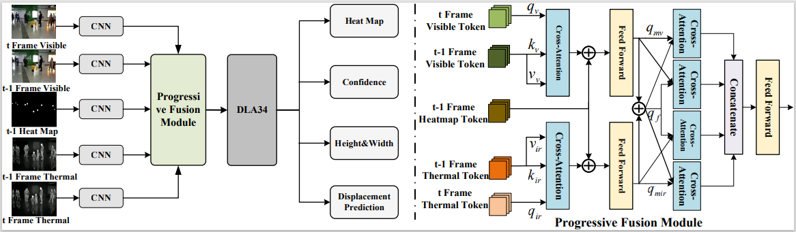

# PFTrack

## Visible-Thermal Multiple Object Tracking: Large-scale Video Dataset and Progressive Fusion Approach

> [**Visible-Thermal Multiple Object Tracking: Large-scale Video Dataset and Progressive Fusion Approach**](https://arxiv.org/abs/2408.00969),            
> Yabin Zhu, Qianwu Wang, Chenglong Li, Jin Tang, Zhixiang Huang  

    @misc{zhu2024visiblethermalmultipleobjecttracking,
      title={Visible-Thermal Multiple Object Tracking: Large-scale Video Dataset and Progressive Fusion Approach}, 
      author={Yabin Zhu and Qianwu Wang and Chenglong Li and Jin Tang and Zhixiang Huang},
      year={2024},
      eprint={2408.00969},
      archivePrefix={arXiv},
      primaryClass={cs.CV},
      url={https://arxiv.org/abs/2408.00969}, 
}
Contact: [wang1597474391@foxmail.com](mailto:wang1597474391@foxmail.com). Any questions or discussion are welcome! 

## Abstract
The complementary benefits from visible and thermal infrared data are widely utilized in various computer vision task, such as visual tracking, semantic segmentation and object detection, but rarely explored in Multiple Object Tracking (MOT). In this work, we contribute a large-scale Visible-Thermal video benchmark for MOT, called VT-MOT. VT-MOT has the following main advantages. 1) The data is large scale and high diversity. VT-MOT includes 582 video sequence pairs, 401k frame pairs from surveillance, drone, and handheld platforms. 2) The cross-modal alignment is highly accurate. We invite several professionals to perform both spatial and temporal alignment frame by frame. 3) The annotation is dense and high-quality. VT-MOT has 3.99 million annotation boxes annotated and double-checked by professionals, including heavy occlusion and object re-acquisition (object disappear and reappear) challenges.
To provide a strong baseline, we design a simple yet effective tracking framework, which effectively fuses temporal information and complementary information of two modalities in a progressive manner, for robust visible-thermal MOT. 
A comprehensive experiment are conducted on VT-MOT and the results prove the superiority and effectiveness of the proposed method compared with state-of-the-art methods. 

## contribution

- We build a large-scale visible-thermal MOT dataset VT-MOT, which can promote the research and development of MOT in all weather and all day. The dataset includes 582 video sequence pairs with 401k frame pairs captured in surveillance, drone and handheld platforms. 
- We perform manual spatio-temporal alignment of all video sequences of both modalities in a frame by frame manner to ensure high-quality alignment of the two modalities. Moreover, dense and high-quality annotation is provided for comprehensive evaluation of different MOT algorithms. These annotation contain 3.99 million bounding boxes and heavy occlusion and object re-acquisition  challenge labels.
- We also propose a simple yet effective progressive fusion tracking framework, which effectively fuses temporal and complementary information of two modalities in a progressive manner, for robust visible-thermal MOT.
- We perform numerous experiments on VT-MOT dataset, and the results prove the superiority and effectiveness of the
proposed method compared with state-of-the-art methods.
## Main results

### Tracking performance comparison of several evaluated trackers on VT-MOT testing set.

| Method       | Publication | Modality | HOTA       | DetA       | MOTP       | IDF1       | MOTA       |
|--------------|:-----------:|:--------:|------------|------------|------------|------------|------------|
| FairMOT      |  IJCV 2021  |    V-T   | 37.35      | 34.628     | 72.525     | 45.795     | 37.266     |
| CenterTrack  |  ECCV 2020  |    V-T   | 39.045     | 38.104     | 72.874     | 44.42      | 30.585     |
| TraDes       |  CVPR 2021  |    V-T   | 38.319     | 36.37      | 72.295     | 47.008     | 34.632     |
| TransTrack   |  arXiv 2021 |    V-T   | 38.00      | 35.711     | 73.823     | 43.567     | 36.156     |
| ByteTracK    |  ECCV 2022  |    V-T   | 38.393     | 32.122     | 73.483     | 45.757     | 33.151     |
| OC-SORT      |  CVPR 2023  |    V-T   | 31.479     | 25.244     | 73.15      | 38.086     | 28.948     |
| MixSort-OC   |  ICCV 2023  |    V-T   | 39.09      | 33.109     | 73.632     | 45.799     | 31.33      |
| MixSort-Byte |  ICCV 2023  |    V-T   | 39.575     | 34.806     | 73.049     | 46.367     | 31.593     |
| PID-MOT      |  TCSVT 2023 |    V-T   | 35.621     | 33.245     | 71.794     | 42.43      | 33.333     |
| Hybrid-SORT  |  AAAI 2024  |    V-T   | 39.485     | 34.619     | 72.840     | 46.310     | 31.074     |
| **Ours **        |      -      |    V-T   | **41.068** | **41.631** | **73.949** | **47.254** | **43.088** |

  

our model can be got in [model](https://pan.baidu.com/s/17ykng7S9x8wVlULeucKryQ?pwd=233w  [233w])

## Installation

Please refer to [INSTALL.md](readme/INSTALL.md) for installation instructions.

# Dataset preparation

If you want to reproduce the results in the paper for benchmark evaluation or training, you will need to setup datasets.

### VT-MOT

MOT is  used to train and evaluate the system. We will only use the training set and  testing set  for developing this project.

We have packed the dataset preprocessing code as a script.

The script includes:

- Download and unzip the dataset from [VTMOT](https://pan.baidu.com/s/1C8rXxVmxg6jAB7Xs7E45zw?pwd=chcw [chcw]).

- Convert it into COCO format using `tools/convert_mot_rgbt_to_coco.py`.

- The output data structure should be:

  ~~~
  ${PFTrack_ROOT}
  |-- data
  `-- |-- VTMOT
      `-- |--- train
          |   |--- video1
          |   |    |--- visible
          |	|	 |	 |---0000001.jpg
          |	|	 |	 |---0000002.jpg
          |	|	 |	 |---...
          |   |	 |--- infrared
          |	|	 |	 |---0000001.jpg
          |	|	 |	 |---0000002.jpg
          |	|	 |	 |---...
          |   |    |--- gt
          |   |    |   |--- gt.txt
          |   |    |--- seqinfo
          |   |--- video2
          |   |--- ...
          |--- test
          |   |--- video1
          |   |    |--- visible
          |	|	 |	 |---0000001.jpg
          |	|	 |	 |---0000002.jpg
          |	|	 |	 |---...
          |   |	 |--- infrared
          |	|	 |	 |---0000001.jpg
          |	|	 |	 |---0000002.jpg
          |	|	 |	 |---...
          |   |    |--- gt
          |   |    |   |--- gt.txt
          |   |    |--- seqinfo
          |   |--- video2
          |   |--- ...
          `---| annotations
              |--- train.json
              `--- test.json
  ~~~

### 

## Use PFTrack

## Training on VT-MOT

~~~
python -u main.py tracking --modal RGB-T --save_all  --exp_id VTMOT_PFTrack  --dataset mot_rgbt --dataset_version mot_rgbt --load_model "./exp/tracking/VTMOT_RGBT/***.pth" --batch_size 12 --pre_hm --ltrb_amodal --same_aug --hm_disturb 0.05 --lost_disturb 0.4 --fp_disturb 0.1 --gpus 0 
~~~

## Testing on VT-MOT

~~~
python test_rgbt.py tracking --modal RGB-T --test_mot_rgbt True --exp_id VTMOT_PFTrack --dataset mot_rgbt --dataset_version mot_rgbt --pre_hm --ltrb_amodal --track_thresh 0.4 --pre_thresh 0.5 --load_model ./exp/tracking/VTMOT_RGBT/model.pth
~~~

## Eval
~~~
cd trackeval
python run_mot_challenge.py
~~~

## Acknowledgement

Tracking Objects as Points: https://github.com/xingyizhou/CenterTrack

trackeval: https://github.com/JonathonLuiten/TrackEval
	
